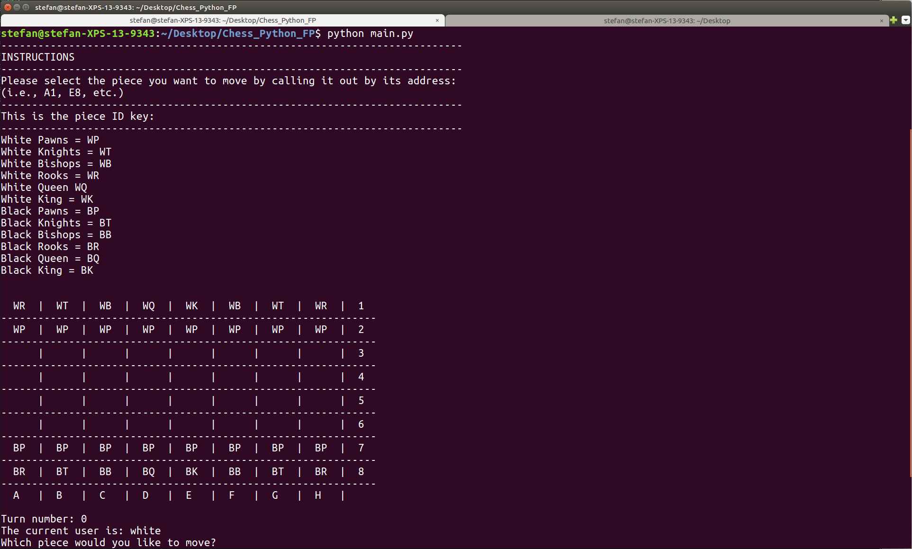

##**Chess Python**

Chess Python is a 2 player chess engine coded in Python using functional programming. The game does not have an AI engine yet. You must play with a friend.

##**Instructions**
To run the program run `python main.py` in the terminal.

##**Views**

